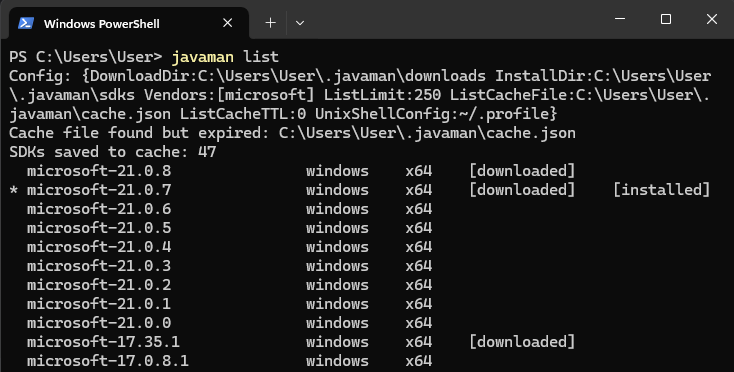

# Java Version Manager

A version manager for Java SDKs.

## Goal

The aim is to allow a quick and convenient management of Java workspace environment.



## Prerequisites

The following operating systems are supported:

- Linux
- MacOS
- Windows

Check [Releases](https://github.com/rpanchyk/javaman/releases) page to download appropriate installation file.

## Installation

1. Unpack installation archive to `$HOME` directory.
2. Add `$HOME/.javaman` to `$PATH` environment variable for availability to run `javaman` user (system) wide.

## Configuration

File `$HOME/.javaman/config.toml` contains many configuration options.

```toml
# Directory where SDK archives are downloaded.
# Can be absolute or relative path.
download_dir = "./downloads"

# Directory where SDKs are installed.
# Typically, it is a part of JAVA_HOME env.
# Can be absolute or relative path.
install_dir = "./sdks"

# List of SDK providers.
vendors = ["microsoft"]

# Max versions number to show in list.
list_limit = 25

# File with list of cached SDKs in JSON format.
list_cache_file = "./cache.json"

# Cache expiration time in minutes.
list_cache_ttl = 1440

# Defines in which file is added loading config string.
# Non-windows property.
# Examples: ~/.profile, ~/.bashrc, ~/.zshrc, etc.
unix_shell_config = "~/.profile"
```

## Usage

The following is shown if `javaman --help` executed:

```
Usage:
  javaman [flags]
  javaman [command]

Available Commands:
  default     Set specified Java version as default
  download    Download specified Java version
  help        Help about any command
  install     Install specified Java version
  list        Shows list of available Java versions
  remove      Remove specified Java version
  version     Shows version of javaman

Flags:
  -h, --help   help for javaman

Use "javaman [command] --help" for more information about a command.
```

For example, let's add Java new version.

1. Show available versions list: `javaman list`

```
  microsoft-21.0.3               windows    x64                    
  microsoft-21.0.2               windows    x64                    
  microsoft-21.0.1               windows    x64                    
  microsoft-21.0.0               windows    x64                    
  microsoft-17.0.15              windows    x64                    
  microsoft-17.0.14              windows    x64                    
  ...
```

2. Install specific version by executing `javaman install microsoft-21.0.3` command.

```
SDK has been installed: /home/user/.javaman/sdks/microsoft-21.0.3
```

3. Set installed version as default one by `javaman default microsoft-21.0.3` command.

```
User environment is set to microsoft-21.0.3 version as default
```

4. (_Important!_) Restart terminal to apply changes.

5. Check versions list again to see the asterisk near the default one with `javaman list` command.

```
* microsoft-21.0.3               windows    x64    [downloaded]    [installed]
  microsoft-21.0.2               windows    x64                    
  microsoft-21.0.1               windows    x64                    
  microsoft-21.0.0               windows    x64                    
  microsoft-17.0.15              windows    x64                    
  microsoft-17.0.14              windows    x64                    
  ...
```

6. Verify everything is expected with `java -version && echo $JAVA_HOME && echo $PATH` command.

```
OpenJDK version "21.0.3"
OpenJDK Runtime Environment Microsoft
OpenJDK 64-Bit Server VM Microsoft

/home/user/.javaman/sdks/microsoft-21.0.3

...;/home/user/.javaman/sdks/microsoft-21.0.3/bin
```

## How it works

- Verify specified SDK version is available.
- Download SDK archive from vendor page.
- Extract archive to `{install_dir}/{version}` directory.
- Set or update `JAVA_HOME` environment variable.
- Add `JAVA_HOME/bin` to `PATH` environment variable.

## Alternatives

This project was fully inspired by [SDKMAN!](https://sdkman.io) but author required native support for Windows.

The same results can be achieved by using Windows Package Manager
such as [WinGet](https://github.com/microsoft/winget-cli) or similar.

## Disclaimer

The software is provided "as is", without warranty of any kind, express or
implied, including but not limited to the warranties of merchantability,
fitness for a particular purpose and noninfringement. in no event shall the
authors or copyright holders be liable for any claim, damages or other
liability, whether in an action of contract, tort or otherwise, arising from,
out of or in connection with the software or the use or other dealings in the
software.

## Contribution

If you have any ideas or inspiration for contributing the project,
please create an [issue](https://github.com/rpanchyk/javaman/issues/new)
or a [pull request](https://github.com/rpanchyk/javaman/pulls).
